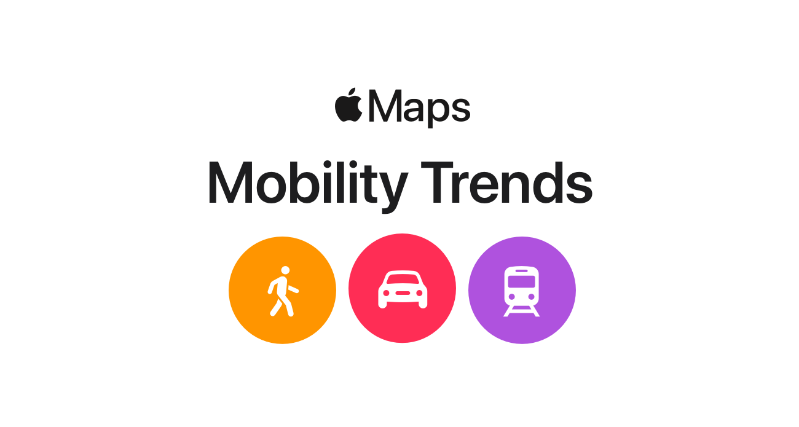

# Apple-Mobility-Trends-Webapp

## Intro:
Apple has been actively supporting the mitigation of the spread of COVID-19 global pandemic. It had partnered with The Centers for Disease Control and Prevention (CDC) in effort to raise safety awareness and to develop screening tools. Additionally, it publishes a daily [COVID-19 Mobility Trends Report](https://covid19.apple.com/mobility) through data it collects from Apple Maps. However, the report's simple interface provides no more functionalities than just a quick location search to find corresponding mobility trends. Therefore, I developed a dashboard web application to help improve data interactivity and interpretability.

To access the Apple Mobility Trends Dashboard, click this [**link**](http://apple-trends-dash-env.eba-fii2naf3.us-east-1.elasticbeanstalk.com).

This web application is built using Plotly Dash framework. Both the frontend and backend operate entirely on a serverless data pipeline. My dashboard is currently deployed on AWS. For more detail on the pipeline infrastructure, refer to the Cloud Architecture section below.

## Features:
The Apple Mobility Trends Dashboard currently contains 3 components that users could interact with:

* **Map:** for location selection (note that the dashboard only supports country-level selection).
* **Datepicker:** for date/period selection.
* **Trends:** for trend visualization.

### Map:
* Hover over a country and the Trends will change accordingly.
* Color encodes the average % change from the baseline across all available transportation types on the most recent day.
* If a country is colored in white, that indicates no data is available for this country.
* Click and drag the map to pan around.
* Scroll to zoom in and out.

### Datepicker:
* Select Start and End Dates and the Trends will change accordingly (Earliest possible date is 2020-01-13).
* Default Start Date is 2020-01-13, default End Date is the most recent date on the latest Apple Mobility Trends Report.
* Click on X to clear selection, goes back to default.

### Trends:
* Trends represents mobility % change for each available transportation type across the selected period.
* Hover over the lines to view the values.
* Press shift, click and drag to pan around.
* Click and drag to Zoom.

## Technology Used:

**Cloud**

* AWS Cloud9
* AWS CloudWatch Timer
* AWS Lambda
* AWS S3
* AWS Elastic Beanstalk

**Package/Framework**

 * Dash
 * Facebook Prophet: for forecasting (currently available in offline mode only)

## Cloud Architecture：

The process and workflow of this data pipeline can be summarized in the figure below:

A Lambda function is designed to download Apple's Mobility Trends Report and save the data to an S3 bucket. This action is set to trigger twice a day through the CloudWatch Timer (0:00 AM and 12:00 PM UTC). The Dash application then reads the latest trends data and updates the dashboard, which is deployed through Elastic Beanstalk.

## Future Work

I originally designed this dashboard that also supported a 30-day forecasting, which was implemented using Facebook Prophet. However, I had trouble installing Prophet in Cloud9, this feature was therefore not deployed in current version. Feel free to try it by running application.py located in the root directory.

* Check Yes to inlude forecasted trends, No to display historical trends only.

